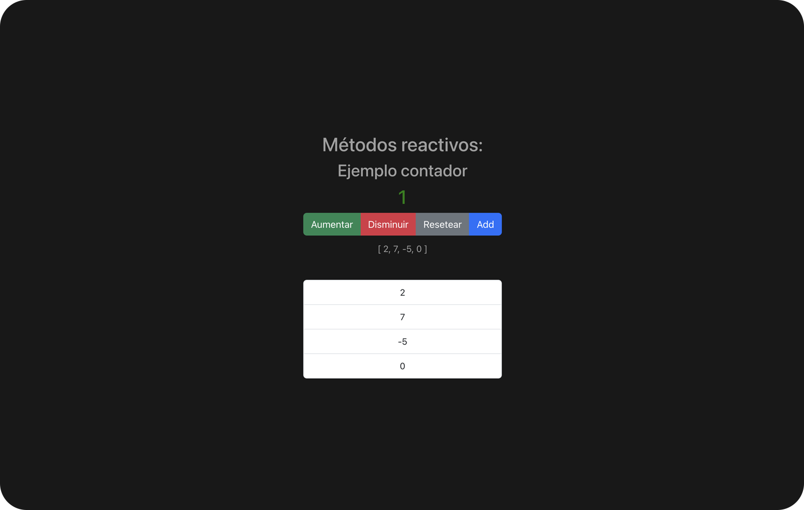

# Counter Vue Project

[](https://vue-project-contador.netlify.app/)

## Description

The Vue.js Counter project offers a simple yet effective solution for tracking and managing numbers interactively. With an intuitive user interface and responsive design, this project allows users to perform the following actions:

Increase and Decrease Count: Users can increment or decrement the count using the "+" and "-" buttons.

Reset Count: The "Reset" button sets the count back to zero, providing a quick way to start over.

Add to Unique Numbers: The "Add to Unique Numbers" button appends the current count to an array of unique numbers. If the number is already in the list, the button becomes disabled to prevent duplicate entries.

This project is built using HTML, CSS, Bootstrap for styling, and Vue.js for managing the interactive elements. It provides a user-friendly experience for counting and tracking unique numbers, making it a versatile tool for various applications.

## Live Demo

You can experience Vue counter project and explore by visiting the live demo on Netlify [Live Demo](https://vue-project-contador.netlify.app/)

## Features

- **Number Counter:** This program allows users to keep track of numbers. They can increase, decrease, or reset the counter to zero with the corresponding buttons.

- **Unique Number Management:** The counter implements functionality to prevent the duplication of numbers in the list. When a number is added to the counter, it is visually highlighted and locked to prevent duplicate entries.

- **Intuitive User Interface:** Using Bootstrap, the user interface is presented in a clean and organized manner. Buttons are easily identifiable, and visual feedback is provided when interacting with them.

## Technologies Used

The Vue.js Counter project has been developed using the following technologies:

- HTML5: HTML5 is utilized to structure and organize the content of the web page.

- CSS3 & Bootstrap: CSS3 and Bootstrap are used for styling and layout to create an appealing and responsive user interface.

- Vue.js: Vue.js is employed to handle interactivity and dynamic content, making it possible to update the counter and manage unique numbers efficiently.

## Badges/Shields

Dev Skills


Build with


Donwload all (Shields or badgets) at:

[URL](https://dev.to/envoy_/150-badges-for-github-pnk)

## Acknowledgments

This project would not have been possible without the incredible community of developers and designers who continually inspire and support each other.

To make this application I have used several resources that I share below.

---

    - Bluuweb & Udemy Vue Course
    - Youtube: [URL](https://youtu.be/PL-aTHv2L3E?si=EJLmveB7RMlee-ZV)

    --> Vue 3 Fundamentals with Composition API: Learn how to build modern, scalable web applications

---

## Recommended IDE Setup

This template should help get you started developing with Vue 3 in Vite.

[VSCode](https://code.visualstudio.com/) + [Volar](https://marketplace.visualstudio.com/items?itemName=Vue.volar) (and disable Vetur) + [TypeScript Vue Plugin (Volar)](https://marketplace.visualstudio.com/items?itemName=Vue.vscode-typescript-vue-plugin).

## Customize configuration

See [Vite Configuration Reference](https://vitejs.dev/config/).

## Project Setup

```sh
npm install
```

### Compile and Hot-Reload for Development

```sh
npm run dev
```

### Compile and Minify for Production

```sh
npm run build
```

## About Me

I'm a junior frontend developer passionate about HTML, CSS and JavaScript, who wants to share the work of all the people who have helped me on the way to being able to dedicate myself to what I like the most.

## Contact

If you have any questions or suggestions, do not hesitate to contact me through my email: [codenaud@gmail.com](mailto:codenaud@gmail.com)

Happy coding! 🚀
